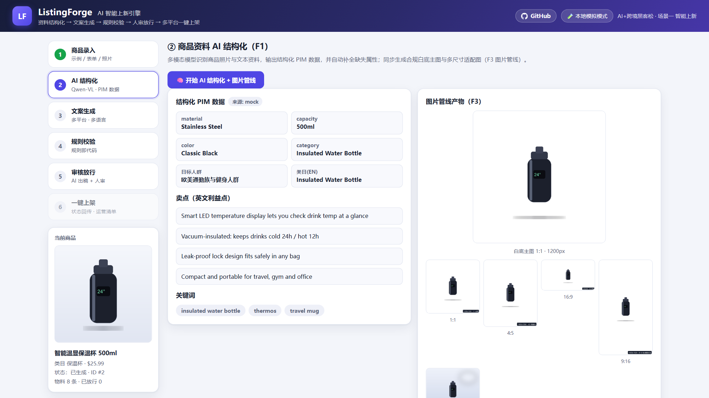
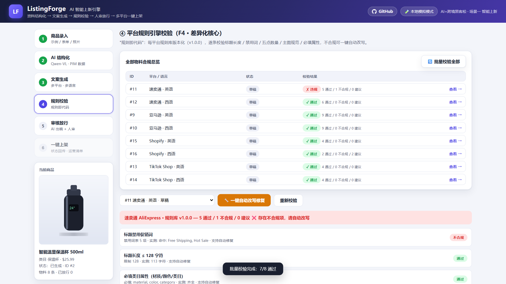
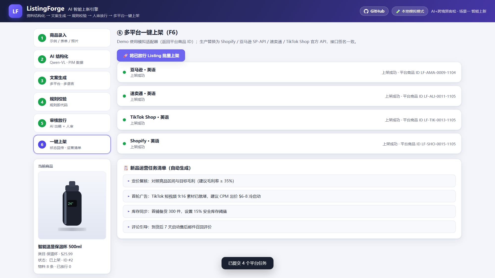

# ListingForge · AI 智能上新引擎

> AI+跨境黑客松巅峰赛（用AI解跨境真命题）· 场景一「AI智能上新」参赛作品
> 基于阿里云百炼（Qwen 系列）设计的端到端 AI 上新引擎：**资料结构化 → 多平台多语言文案 → 白底主图/多尺寸图 → 平台规则校验 → 人审放行 → 一键上架**

   

---

## 🖼️ 界面速览

**AI 结构化 + 图片管线**（PIM 数据 / 白底主图 / 多尺寸适配）：



**平台规则引擎**（全物料合规矩阵 + 逐条校验 + 一键自动改写）：



**批量审核放行 → 多平台一键上架**（状态回传 + 运营任务清单）：



---

## ⚡ 体验方式（60 秒跑起来）

```bash
# 1. 安装依赖（Python ≥ 3.10）
pip install -r requirements.txt

# 2. 启动
python run.py

# 3. 浏览器打开
http://127.0.0.1:8000
```

**默认开箱即用**：无任何 API Key 时运行在「本地模拟模式」，全部功能离线可用（内置 3 个示例商品，一键演示全流程）。

**切换百炼实时模式**（推荐，体现真实 AI 能力）：

```bash
# Windows PowerShell
$env:DASHSCOPE_API_KEY="sk-你的百炼Key"; python run.py

# macOS / Linux
DASHSCOPE_API_KEY=sk-你的百炼Key python run.py
```

设置后自动调用阿里云百炼 `qwen-vl-max`（商品图识别）与 `qwen-plus`（多平台文案生成），调用失败自动降级模拟模式，Demo 永不中断。

### 界面操作路径（六步流）

| 步骤 | 操作 | 体现功能 |
|---|---|---|
| ① 商品录入 | 点击示例商品卡片 / 自定义表单上传照片 | 多输入源 |
| ② AI 结构化 | 点「开始 AI 结构化」→ 查看 PIM 数据与合规主图 | Qwen-VL 识别 + 图片管线 |
| ③ 文案生成 | 选平台×语言 → 「一键生成全套 Listing」 | 文案工厂（4 平台 × 4 语言） |
| ④ 规则校验 | 切换到速卖通查看违规 → 「一键自动改写」 | 规则引擎「规则即代码」 |
| ⑤ 审核放行 | 修改字段 → 放行 / 批量放行 | AI 出稿 + 人审 |
| ⑥ 一键上架 | 「批量上架」→ 状态回传 + 运营任务清单 | 平台适配层 |

其他体验入口：

- **API 文档（Swagger）**：http://127.0.0.1:8000/docs
- **一键脚本演示**：见 `docs/体验方式.md`（含 curl/httpx 全流程脚本）
- **演示视频**：`video/listingforge_demo.mp4`（60 秒全流程录屏讲解）

---

## 🎯 解决什么问题

跨境卖家上新一个 SKU 需 2-5 天：写英文文案、做主图、按 4 个平台的规则逐个改写、逐平台上架，重复劳动占 70%+。ListingForge 将全流程压缩到 **分钟级**：

- 一次生成 **4 平台 × 4 语言** 全套物料（标题/五点/描述/SEO）；
- 平台规则引擎逐条校验（标题字数、禁用词、五点数量、主图规范、必填属性），**违规自动改写**，降低上架被拒率；
- 图片管线自动产出**合规白底主图**（1:1 ≥1000px）与 4:5 / 16:9 / 9:16 多尺寸适配图；
- **AI 出稿 + 人审放行**，全流程留痕，可商用可信赖。

## 🏗️ 技术架构

```
前端工作台 (原生 JS SPA, 零构建)
        │
FastAPI 编排层 (Python)  ──  SQLite 持久化 (生产: PostgreSQL)
   │         │          │
文案引擎    规则引擎     图片管线
generator  rules_engine imaging
   │         │          │
百炼 API   app/rules/   OpenCV 抠图
(Qwen-VL /  *.json      + Pillow 白底/
 Qwen-Plus) 规则即代码    多尺寸适配
```

详细设计见 **[docs/技术说明.md](docs/技术说明.md)**。

## 📁 目录结构

```
ListingForge/
├── run.py                  # 一键启动
├── requirements.txt        # 运行依赖
├── requirements-dev.txt    # 开发依赖（pytest）
├── pytest.ini / tests/     # 测试套件（规则引擎/生成器/图片管线/API 全流程）
├── .github/workflows/ci.yml  # CI（3.10 / 3.12 双版本跑测试）
├── app/
│   ├── main.py             # FastAPI 路由与编排
│   ├── generator.py        # 文案引擎（模拟模式 + 百炼实时模式，4 线程并发生成）
│   ├── rules_engine.py     # 平台规则引擎（校验 + 自动改写，规则库热加载）
│   ├── imaging.py          # 图片管线（抠图/白底主图/多尺寸/场景图，幂等缓存）
│   ├── database.py         # SQLite 数据层（WAL + 索引）
│   ├── samples.py          # 内置示例商品
│   ├── rules/              # ★ 四平台规则库（JSON，可版本化、热加载）
│   │   ├── amazon.json  ├── aliexpress.json
│   │   ├── tiktok_shop.json  └── shopify.json
│   └── static/             # 前端工作台（会话恢复 / 历史商品切换 / 校验矩阵）
├── scripts/
│   ├── make_product_images.py   # 生成示例商品图
│   ├── make_demo_video.py       # 演示视频合成脚本
│   └── demo_e2e.py              # 一键 E2E 演示
├── docs/
│   ├── 技术说明.md  ├── 体验方式.md  ├── 优化方案.md
│   └── images/      # README 截图
├── video/listingforge_demo.mp4   # 演示视频
└── assets/                 # 示例商品图
```

## 🔑 差异化设计

1. **规则即代码**——平台规则是 `app/rules/*.json` 版本化规则库而非散落的 prompt；新增平台 = 新增一份 JSON；规则变更只需改库，生成逻辑零改动。
2. **LLM 只做创作、规则引擎做校验**——数字与合规可审计，AI 稿件先过规则闸门再进人审。
3. **多语言本地化重写**——西/葡/阿语按类目整段重写而非直译（`LOCALIZED_LIBRARY`），小语种市场零边际成本。
4. **AI 出稿 + 人审放行**——贴合品牌卖家真实工作流，可商用。
5. **百炼一体化**——Qwen-VL / Qwen-Plus 双模型 + OpenAI 兼容接口，一个环境变量切换真实/模拟模式。

## 🧪 快速自检

```bash
python run.py   # 启动后另开终端
curl http://127.0.0.1:8000/api/meta          # {"mode":"mock"...}
curl -X POST http://127.0.0.1:8000/api/products/sample/bottle

# 测试套件（19 个用例：规则引擎 / 生成器 / 图片管线 / API 全流程）
pip install -r requirements-dev.txt && python -m pytest
```

> 刷新页面会自动恢复上次进度（会话持久化），侧栏可随时切换历史商品。
>
> **CI**：`.github/workflows/ci.yml` 已就绪（Python 3.10/3.12 跑 pytest）。因推送 workflow 文件需要 token 的 `workflow` 权限，启用只需：`gh auth refresh -h github.com -s workflow` 后执行 `git add .github && git push`。

## 📄 License

MIT（见 [LICENSE](LICENSE)；Demo 用途；生产接入请遵守各平台 API 服务条款）
